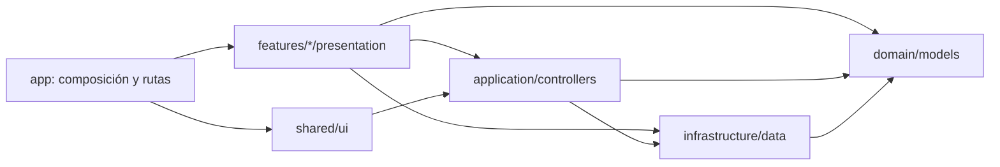

# LearnV

[](https://github.com/DevKAlpha/LearnV/actions/workflows/deploy-pages.yml)
[](https://github.com/DevKAlpha/LearnV/actions/workflows/prerelease.yml)

Aplicación web móvil para preparar una candidatura de pregrado a la **Global Korea Scholarship (GKS-U)** desde España. LearnV reúne seguimiento de preparación, información oficial, recursos de inglés y coreano, prácticas progresivas, preparación de entrevistas y un simulador del expediente escrito.

**Producción:** [devkalpha.github.io/LearnV](https://devkalpha.github.io/LearnV/)

> LearnV es una herramienta educativa privada. No representa a NIIED, Study in Korea, la Embajada de la República de Corea ni una universidad. Las convocatorias vigentes y sus documentos oficiales siempre prevalecen.

## Qué incluye

| Apartado | Propósito |
| --- | --- |
| **Inicio** | Resume el avance, propone tareas diarias y mantiene visibles los objetivos TOPIK I → TOPIK II e inglés B1/B2 → C1. |
| **Beca** | Presenta el radar GKS-U, datos por convocatoria, programas de referencia, fuentes oficiales y videos relacionados con la preparación desde España. |
| **Estudiar** | Separa inglés y coreano, organiza recursos y ofrece rutas progresivas de escritura, escucha y pronunciación/entrevista. |
| **Entrevistas** | Incluye preguntas, repreguntas, estructura de respuesta, temporizador y criterios de autoevaluación. |
| **Simulador escrito** | Practica decisiones de candidatura, Personal Statement, Study Plan y revisión de coherencia. No simula una prueba nacional inexistente. |
| **Documentos** | Mantiene una lista local de documentos de candidatura sin subir certificados, pasaportes ni expedientes. |
| **Perfil** | Conserva los datos base y refleja los niveles obtenidos mediante las prácticas de LearnV. |

La interfaz funciona en español, inglés y coreano, incluye temas claro/oscuro, navegación inferior fija, animaciones con reducción de movimiento y diseño mobile-first desde 320 px.

## Tecnologías

- React 19 y TypeScript estricto.
- Vite 7 para desarrollo y compilación.
- React Router 7 con rutas diferidas por pantalla.
- Animaciones CSS aceleradas por composición e `IntersectionObserver`, con reducción de movimiento y sin un motor visual pesado en la carga inicial.
- Carga diferida por ruta, precarga por intención y renderizado diferido de colecciones fuera de pantalla.
- Barrera de preparación visual que espera fuentes, imágenes visibles y transiciones antes de entregar cada pantalla, y vuelve a comprobarla al reanudar la app en móviles.
- Vitest para reglas de dominio y validación de datos.
- CSS propio con variables temáticas y paleta inspirada en tulipanes.
- Docker + Nginx para ejecución autocontenida.
- GitHub Actions + GitHub Pages para actualización y despliegue.

## Arquitectura

LearnV usa **MVC modular por funcionalidad**. Las reglas y los datos permanecen separados de React; cada apartado contiene sus vistas, mientras el núcleo de la aplicación se limita a composición, proveedores y enrutamiento.



- **Model:** `src/domain` define tipos, estados y reglas puras; `src/infrastructure` contiene catálogos, fuentes y adaptadores de datos.
- **Controller:** `src/application` coordina estado, persistencia local, idioma, tema y casos de uso.
- **View:** `src/features/*/presentation` contiene pantallas específicas; `src/shared/ui` contiene componentes visuales reutilizables.
- **Composition root:** `src/app` conecta proveedores, layout, navegación, carga diferida y rutas.

### Estructura

```text
src/
├── app/
│   ├── App.tsx                 # shell principal
│   ├── layout/                 # cabecera, navegación y guía global
│   ├── providers/              # idioma, tema, router y movimiento
│   └── routing/                # tabla de rutas, loader y scroll
├── application/
│   ├── controllers/            # casos de uso y persistencia local
│   ├── i18n/                   # selección y reglas de idioma
│   └── theme/                  # tema claro/oscuro
├── domain/models/              # lógica pura y tipos del negocio
├── infrastructure/
│   ├── data/                   # GKS, recursos y pruebas
│   └── i18n/                   # catálogo ES/EN/KO
├── features/
│   ├── home/presentation/
│   ├── scholarship/presentation/
│   ├── study/presentation/
│   ├── documents/presentation/
│   └── profile/presentation/
├── shared/ui/                  # iconos SVG y componentes comunes
├── styles/app.css              # tokens, temas y estilos mobile-first
└── main.tsx                    # punto de entrada
```

Los imports internos pueden usar el alias `@/`, definido en `tsconfig.app.json` y `vite.config.ts`. `pnpm run check:architecture` impide dependencias inversas entre capas y accesos directos entre funcionalidades.

## Flujo de datos y privacidad

LearnV no necesita backend. El progreso, borradores del simulador, preferencias y casillas se guardan en `localStorage` del dispositivo. Las grabaciones de práctica permanecen en el navegador y no se suben.

Los videos usan carga diferida desde `youtube-nocookie.com` y conservan un enlace externo alternativo. La síntesis de voz y las funciones de grabación dependen de las capacidades y permisos del navegador.

No deben añadirse al repositorio certificados, documentos de identidad, expedientes, direcciones, credenciales ni información personal real.

## Instalación local

Requisitos: Node.js 22 y pnpm 11.

```bash
corepack enable
pnpm install
pnpm dev
```

Vite mostrará la dirección local disponible, normalmente `http://localhost:5173`.

## Comandos

| Comando | Función |
| --- | --- |
| `pnpm dev` | Servidor de desarrollo. |
| `pnpm test` | Ejecuta las pruebas automatizadas. |
| `pnpm run typecheck` | Valida TypeScript estricto. |
| `pnpm run check:architecture` | Revisa los límites entre módulos y capas. |
| `pnpm build` | Compila producción y crea el fallback de rutas para Pages. |
| `pnpm preview` | Sirve localmente la compilación. |
| `pnpm gks:update` | Actualiza manualmente el radar oficial. |
| `pnpm validate` | Ejecuta arquitectura, pruebas y compilación completa. |
| `pnpm release:check` | Valida el archivo `VERSION` cuando se abre un ciclo de lanzamiento. |

Antes de integrar cualquier historia debe pasar:

```bash
pnpm validate
```

## Docker

```bash
docker compose up --build
```

La aplicación quedará disponible en `http://localhost:8080`. Nginx sirve los archivos estáticos y resuelve las rutas de la SPA.

## GitHub Pages y radar GKS

El workflow `.github/workflows/deploy-pages.yml` se ejecuta únicamente desde `main`, además de una comprobación diaria programada. Sus pasos instalan dependencias bloqueadas, consultan el radar oficial, compilan `dist` y publican Pages.

La aplicación usa `BrowserRouter` con `basename` calculado por Vite. `scripts/create-spa-fallback.mjs` genera `dist/404.html`, por lo que una ruta interna puede abrirse directamente en el dominio de GitHub Pages.

El radar detecta disponibilidad y cambios en fuentes oficiales; no convierte automáticamente una variación web en un requisito confirmado. La convocatoria vigente debe verificarse antes de presentar documentos.

## Estrategia de ramas y lanzamientos

LearnV separa la integración del lanzamiento:

- `prerelease` reúne historias finalizadas, ejecuta la validación completa y genera un artefacto temporal para pruebas.
- `main` contiene únicamente versiones aprobadas y es la única rama que despliega GitHub Pages.

Cada apartado se trabaja en su rama asignada:

| Rama | Responsabilidad principal |
| --- | --- |
| `home` | Inicio, plan diario, recordatorios y objetivos. |
| `scholarship` | Beca, radar, fuentes, programas y videos GKS. |
| `study` | Idiomas, recursos, pruebas, entrevistas y simulador escrito. |
| `documents` | Checklist y preparación documental. |
| `profile` | Perfil y resumen de niveles/progreso. |
| `platform` | Arquitectura, navegación global, UI compartida, CI y documentación. |
| `prerelease` | Integración, validación integral y artefactos previos al lanzamiento. |
| `main` | Producción y contenido final liberado. |

### Trabajo en un apartado

```bash
git switch prerelease
git pull --ff-only origin prerelease
git switch study              # sustituir por la rama correspondiente
git merge prerelease

# realizar cambios
pnpm validate
git add <archivos-del-apartado>
git commit -m "feat: descripcion breve"
git push origin study
```

Después se abre un **Pull Request hacia `prerelease`** usando la plantilla del repositorio. Ninguna historia o corrección funcional apunta directamente a `main`.

Una vez integrado el PR, la rama del apartado se sincroniza:

```bash
git switch prerelease
git pull --ff-only origin prerelease
git switch study
git merge prerelease
git push origin study
```

Los cambios que afecten más de un apartado se realizan en `platform` o en una rama temporal `feature/<historia>-<descripcion>`, se validan y se integran en `prerelease` mediante PR.

Solo un Pull Request procedente de `prerelease` puede apuntar a `main`. La compuerta de producción vuelve a ejecutar todas las pruebas y exige una versión preparada. La primera versión futura usará el formato `1.0.0A`, pero todavía no ha sido asignada ni se ha creado el archivo `VERSION`.

El procedimiento completo, el formato de commits versionados y la creación de GitHub Releases se encuentran en [`docs/RELEASES.md`](docs/RELEASES.md).

## Actualización de contenidos

- Convocatoria, documentos, tareas y fuentes: `src/infrastructure/data/gks-2026.ts`.
- Videos de orientación GKS: `src/infrastructure/data/gks-feedback-videos.ts`.
- Recursos educativos: `src/infrastructure/data/learning-resources.ts`.
- Prácticas de idioma: `src/infrastructure/data/practice-tests.ts`.
- Entrevistas: `src/infrastructure/data/interview-prep.ts`.
- Simulador escrito: `src/infrastructure/data/written-simulator.ts`.
- Traducciones: `src/infrastructure/i18n/translations.ts`.

Todo recurso nuevo debe indicar su fuente, abrir el contenido original y diferenciar claramente entre requisito oficial, referencia histórica y práctica educativa.

## Control de calidad

Además de `pnpm validate`, una historia visual debe revisarse en:

- 320 px y 390 px de ancho.
- Español, inglés y coreano.
- Temas claro y oscuro.
- Navegación táctil, teclado y reducción de movimiento.
- Apertura directa de rutas bajo `/LearnV/`.
- Consola sin errores y sin desplazamiento horizontal involuntario.

El informe de la validación integral más reciente está en [`docs/VALIDATION-2026-08-23.md`](docs/VALIDATION-2026-08-23.md).
